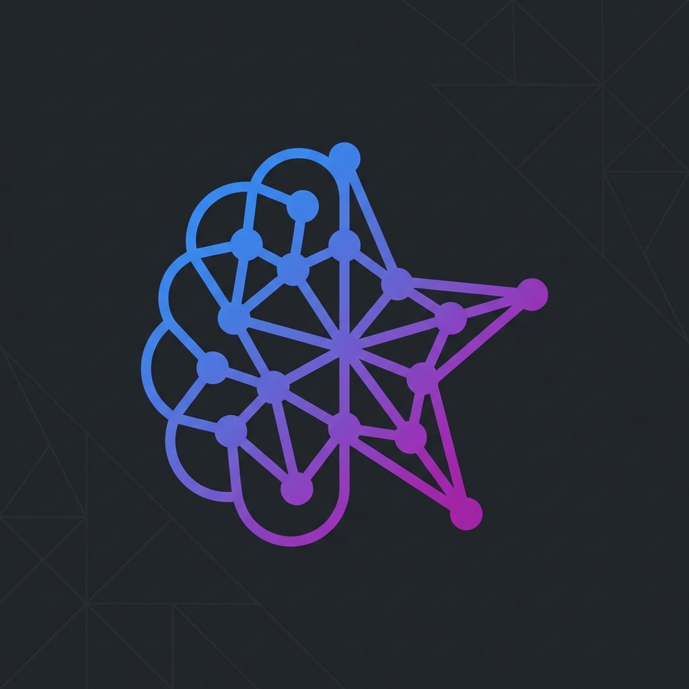

  

# Skill Manager for Google Antigravity

[](https://marketplace.visualstudio.com/)
[](LICENSE)

🧠 **Browse, search, and install Antigravity skills from GitHub repositories with a beautiful UI.**


## Features

- **🔍 Browse Skills**: Explore skills from community repositories with a beautiful webview interface
- **⚡ Quick Install**: One-click installation of skills to your Antigravity environment
- **📦 Batch Install**: Select and install multiple skills at once
- **🔎 Search & Filter**: Find skills by name, description, or category
- **📁 Manage Installed**: View, open, and uninstall skills from the sidebar
- **🔄 Auto Caching**: Smart caching with ETag support for fast browsing
- **🌐 Multi-Repo Support**: Configure multiple skill repositories

## Installation

### From VS Code Marketplace

1. Open VS Code
2. Go to Extensions (`Cmd+Shift+X` / `Ctrl+Shift+X`)
3. Search for "Skill Manager Antigravity"
4. Click Install

### From VSIX

1. Download the `.vsix` file from [Releases](https://github.com/antigravity-extensions/skill-manager/releases)
2. In VS Code: `Extensions` → `...` menu → `Install from VSIX...`

## Usage

### Browse Skills

1. Open Command Palette (`Cmd+Shift+P` / `Ctrl+Shift+P`)
2. Run `Skill Manager: Browse Skills`
3. Browse, search, and install skills from the webview panel

### Quick Install

1. Open Command Palette
2. Run `Skill Manager: Quick Install Skill`
3. Enter the skill path (e.g., `rominirani/antigravity-skills/skills_tutorial/git-commit-formatter`)

### Manage Installed Skills

- View installed skills in the **Skill Manager** sidebar panel
- Click a skill to open its `SKILL.md`
- Right-click for more options (Open Folder, Uninstall)

## Configuration

| Setting | Description | Default |
|---------|-------------|---------|
| `skillManager.repositories` | GitHub repositories to fetch skills from | `["rominirani/antigravity-skills", "sickn33/antigravity-awesome-skills"]` |
| `skillManager.installPath` | Custom install path for skills | `~/.gemini/antigravity/skills/` |
| `skillManager.githubToken` | GitHub PAT for higher API rate limits | `""` |
| `skillManager.cacheExpiry` | Cache expiry time in seconds | `3600` |

### Setting a GitHub Token (Optional)

For higher API rate limits (5000/hour vs 60/hour):

1. Create a [GitHub Personal Access Token](https://github.com/settings/tokens)
2. Open VS Code Settings
3. Search for `skillManager.githubToken`
4. Paste your token

## Skill Repositories

By default, skills are fetched from these community repositories:

- [rominirani/antigravity-skills](https://github.com/rominirani/antigravity-skills) - Official example skills
- [sickn33/antigravity-awesome-skills](https://github.com/sickn33/antigravity-awesome-skills) - Community aggregator with 58+ skills

Add your own repositories in settings:

```json
{
  "skillManager.repositories": [
    "your-username/your-skills-repo"
  ]
}
```

## Requirements

- VS Code 1.85.0 or higher
- Google Antigravity IDE (for using installed skills)

## Development

```bash
# Clone the repository
git clone https://github.com/antigravity-extensions/skill-manager.git
cd skill-manager

# Install dependencies
npm install

# Compile TypeScript
npm run compile

# Launch Extension Development Host
# Press F5 in VS Code
```

## Contributing

Contributions are welcome! Please read our [Contributing Guide](CONTRIBUTING.md) for details.

## License

Apache 2.0 - See [LICENSE](LICENSE) for details.

---

**Made with ❤️ for the Antigravity community**
